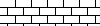
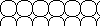
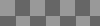
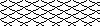
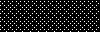
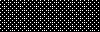
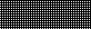
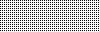
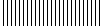

.. -*- mode: rst -*-
.. This text is in reStucturedText format, so it may look a bit odd.
.. See http://docutils.sourceforge.net/rst.html for details.

================================
GraphicsMagick Supported Formats
================================

.. _animate : animate.html
.. _composite : composite.html
.. _compare : compare.html
.. _conjure : conjure.html
.. _convert : convert.html
.. _display : display.html
.. _identify : identify.html
.. _import : import.html
.. _mogrify : mogrify.html
.. _montage : montage.html

.. _AVI : http://www.jmcgowan.com/avi.html
.. _BMP : http://www.fileformat.info/format/bmp/egff.htm
.. _color : color.html
.. _CALS : http://www.fileformat.info/format/cals/egff.htm
.. _CGM : http://www.fileformat.info/format/cgm/egff.htm
.. _CIN : motion-picture.html
.. _DICOM : http://dicom.nema.org/
.. _DICONDE : http://www.geinspectiontechnologies.com/en/products/software/diconde.html
.. _DPX : motion-picture.html
.. _FIG : foo.bar
.. _FITS : http://www.cv.nrao.edu/fits/
.. _Ghostscript : http://pages.cs.wisc.edu/~ghost/
.. _GIF : http://www.fileformat.info/format/gif/egff.htm
.. _`Hald CLUT` : http://www.quelsolaar.com/technology/clut.html
.. _JBIG : http://www.jpeg.org/
.. _JNG : http://www.libmng.com/
.. _JPEG : http://www.jpeg.org/
.. _M2V : http://www.mpeg.org/
.. _MIFF : miff.html
.. _MNG : http://www.libmng.com/
.. _MPEG : http://www.mpeg.org/
.. _MTV : http://www.fileformat.info/format/mtv/egff.htm
.. _MathWorks : http://www.mathworks.com/
.. _PAM : http://netpbm.sourceforge.net/doc/pam.html
.. _PBM : http://www.fileformat.info/format/pbm/egff.htm
.. _PCX : http://www.fileformat.info/format/pcx/egff.htm
.. _PWP : http://www.photoworks.com/
.. _README : README.html
.. _Radiance : http://radsite.lbl.gov/radiance/HOME.html
.. _SANE : http://www.mostang.com/sane/
.. _SCT : http://oreilly.com/www/centers/gff/formats/scitex/
.. _SFW : http://www.algonet.se/~cyren/sfw/
.. _SMPTE : http://www.smpte.org/
.. _SVG : http://www.w3.org/Graphics/SVG/
.. _TIFF : http://www.remotesensing.org/libtiff/
.. _TopoL : http://www.topol.cz/english/share/index.php3
.. _VIFF: http://www.fileformat.info/format/viff/egff.htm
.. _WBMP : http://www.openmobilealliance.org/Technical/wapindex.aspx
.. _WMF : http://www.fileformat.info/format/wmf/egff.htm
.. _WPG : http://www.fileformat.info/format/wpg/egff.htm
.. _XBM : http://www.fileformat.info/format/xbm/egff.htm
.. _XPM : http://www.fileformat.info/format/xpm/egff.htm
.. _XWD : http://www.fileformat.info/format/xwd/egff.htm
.. _freetype2 : http://www.freetype.org/
.. _hp2xx : http://www.gnu.org/software/hp2xx/hp2xx.html
.. _html2ps : http://user.it.uu.se/~jan/
.. _jasper : http://www.ece.uvic.ca/~mdadams/jasper/
.. _jbigkit : http://www.cl.cam.ac.uk/~mgk25/jbigkit/
.. _libxml2 : http://xmlsoft.org/
.. _mpeg2vidcodec : foo.bar
.. _ralcgm : http://www.agocg.ac.uk/train/cgm/ralcgm.htm

GraphicsMagick uses an ASCII string known as "magick" (e.g. "GIF") to
identify file formats, algorithms acting as formats, built-in images, and
embedded profile types. After a file has been read or "pinged", the
associated magick string is stored in the "magick" member of the Image
structure, and is reported in the default output of 'gm identify'.

GraphicsMagick supports reading over 88 major file formats (not including
sub-formats). The following table provides a summary of the supported
image formats.

.. table:: Supported Image Formats

   +--------------+------+---------------------------+--------------------------------------------------+
   | Format       | Mode |        Description        |                      Notes                       |
   +--------------+------+---------------------------+--------------------------------------------------+
   |              |      |                           | Format originally used on the Macintosh          |
   | ART          | RW   | PFS: 1st Publisher        | (MacPaint?) and later used for PFS: 1st          |
   |              |      |                           | Publisher clip art.                              |
   +--------------+------+---------------------------+--------------------------------------------------+
   | AVS          | RW   | AVS X image               |                                                  |
   +--------------+------+---------------------------+--------------------------------------------------+
   | BMP_         | RW   | Microsoft Windows bitmap  |                                                  |
   +--------------+------+---------------------------+--------------------------------------------------+
   | CALS_        | R    | Continuous Acquisition    | Specified in MIL-R-28002 and MIL-PRF-28002.      |
   |              |      | and Life-cycle Support    | Standard blueprint archive format as used by the |
   |              |      | Type 1 image              | US military to replace microfiche.               |
   +--------------+------+---------------------------+--------------------------------------------------+
   | CIN_         | R    | Kodak Cineon              | Kodak Cineon Log format (4.5 draft).             |
   |              |      |                           | Precursor to SMPTE DPX_                          |
   +--------------+------+---------------------------+--------------------------------------------------+
   | CGM_         | R    | Computer Graphics         | Requires ralcgm_ to render CGM files.            |
   |              |      | Metafile                  |                                                  |
   +--------------+------+---------------------------+--------------------------------------------------+
   | CMYK         | RW   | Raw cyan, magenta,        | Use -size, -depth, -endian, and -interlace to    |
   |              |      | yellow, and black samples | specify the image width, height, depth, byte     |
   |              |      |                           | order, and interlace.                            |
   +--------------+------+---------------------------+--------------------------------------------------+
   | CUR          | R    | Microsoft Cursor Icon     |                                                  |
   +--------------+------+---------------------------+--------------------------------------------------+
   | CUT          | R    | DR Halo                   |                                                  |
   +--------------+------+---------------------------+--------------------------------------------------+
   |              |      | Digital Imaging and       | Used by the medical community for images like    |
   | DCM          | R    | Communications in         | X-rays. See the NEMA DICOM_ web site for more    |
   |              |      | Medicine (DICOM_) image   | information. DICOM_ is the basis for the         |
   |              |      |                           | DICONDE_ format.                                 |
   +--------------+------+---------------------------+--------------------------------------------------+
   | DCX          | RW   | ZSoft IBM PC multi-page   |                                                  |
   |              |      | Paintbrush image          |                                                  |
   +--------------+------+---------------------------+--------------------------------------------------+
   |              |      | Microsoft Windows Device  | DIB is a BMP file without the BMP header. Used   |
   | DIB          | RW   | Independent Bitmap        | to support embedded images in compound formats   |
   |              |      |                           | like WMF.                                        |
   +--------------+------+---------------------------+--------------------------------------------------+
   |              |      |                           | RGB and grayscale are fully supported at 1, 8,   |
   |              |      |                           | 10, 12, and 16 bits as per the SMPTE_ 268M-2003  |
   |              |      |                           | (V2.0) specification. This includes support for  |
   | DPX_         | RW   | Digital Moving Picture    | images stored in a planar (multi-element)        |
   |              |      | Exchange                  | configuration and Cineon Log RGB. Rec. 601 and   |
   |              |      |                           | 709 YCbCr are fully supported with 4:4:4 and     |
   |              |      |                           | 4:2:2 subsampling. DPX_ is commonly used to      |
   |              |      |                           | store image frames in film and HDTV production.  |
   +--------------+------+---------------------------+--------------------------------------------------+
   | EMF          | R    | Microsoft Enhanced        | Only available under Microsoft Windows.          |
   |              |      | Metafile (32-bit)         |                                                  |
   +--------------+------+---------------------------+--------------------------------------------------+
   | EPDF         | RW   | Encapsulated Portable     |                                                  |
   |              |      | Document Format           |                                                  |
   +--------------+------+---------------------------+--------------------------------------------------+
   |              |      | Adobe Encapsulated        |                                                  |
   | EPI          | RW   | PostScript Interchange    | Requires Ghostscript_ to read.                   |
   |              |      | format                    |                                                  |
   +--------------+------+---------------------------+--------------------------------------------------+
   | EPS          | RW   | Adobe Encapsulated        | Requires Ghostscript_ to read.                   |
   |              |      | PostScript                |                                                  |
   +--------------+------+---------------------------+--------------------------------------------------+
   | EPS2         | W    | Adobe Level II            | Requires Ghostscript_ to read.                   |
   |              |      | Encapsulated PostScript   |                                                  |
   +--------------+------+---------------------------+--------------------------------------------------+
   | EPS3         | W    | Adobe Level III           | Requires Ghostscript_ to read.                   |
   |              |      | Encapsulated PostScript   |                                                  |
   +--------------+------+---------------------------+--------------------------------------------------+
   | EPSF         | RW   | Adobe Encapsulated        | Requires Ghostscript_ to read.                   |
   |              |      | PostScript                |                                                  |
   +--------------+------+---------------------------+--------------------------------------------------+
   |              |      | Adobe Encapsulated        |                                                  |
   | EPSI         | RW   | PostScript Interchange    | Requires Ghostscript_ to read.                   |
   |              |      | format                    |                                                  |
   +--------------+------+---------------------------+--------------------------------------------------+
   |              |      | Adobe Encapsulated        |                                                  |
   | EPT          | RW   | PostScript Interchange    | Requires Ghostscript_ to read.                   |
   |              |      | format with TIFF_ preview |                                                  |
   +--------------+------+---------------------------+--------------------------------------------------+
   |              |      |                           | Note that FAX machines use non-square pixels     |
   |              |      |                           | which are 1.5 times wider than they are tall but |
   |              |      |                           | computer displays use square pixels, so FAX      |
   | FAX          | RW   | Group 3 FAX               | images may appear to be narrow unless they are   |
   |              |      |                           | explicitly resized using a resize specification  |
   |              |      |                           | of "150x100%". Please note that this is *not* a  |
   |              |      |                           | TIFF_ format.                                    |
   +--------------+------+---------------------------+--------------------------------------------------+
   | FIG          | R    | FIG graphics format       | Requires TransFig.                               |
   +--------------+------+---------------------------+--------------------------------------------------+
   | FITS_        | RW   | Flexible Image Transport  |                                                  |
   |              |      | System                    |                                                  |
   +--------------+------+---------------------------+--------------------------------------------------+
   | FPX          | RW   | FlashPix Format           | Requires FlashPix SDK.                           |
   +--------------+------+---------------------------+--------------------------------------------------+
   |              |      |                           | 8-bit RGB PseudoColor with up to 256 palette     |
   |              |      |                           | entires. Specify the format "GIF87" to write the |
   |              |      | CompuServe Graphics       | older version 87a of the format.                 |
   | GIF_         | RW   | Interchange Format        |                                                  |
   |              |      |                           | The PNG format provides a superior set of        |
   |              |      |                           | features to GIF. Consider using PNG format       |
   |              |      |                           | rather than GIF if clients are able to read PNG. |
   +--------------+------+---------------------------+--------------------------------------------------+
   | GRAY         | RW   | Raw gray samples          | Use -size, -depth, and -endian to specify the    |
   |              |      |                           | image width, height, depth, and byte order.      |
   +--------------+------+---------------------------+--------------------------------------------------+
   | GRAYA        | RW   | Raw gray samples + alpha  | Use -size, -depth, and -endian to specify the    |
   |              |      |                           | image width, height, depth, and byte order.      |
   +--------------+------+---------------------------+--------------------------------------------------+
   | HPGL         | R    | HP-GL plotter language    | Requires hp2xx_ 3.2.0 or later                   |
   +--------------+------+---------------------------+--------------------------------------------------+
   |              |      | Hypertext Markup Language |                                                  |
   | HTML         | RW   | with a client-side image  | Also known as "HTM". Requires html2ps to read.   |
   |              |      | map                       |                                                  |
   +--------------+------+---------------------------+--------------------------------------------------+
   | ICO          | R    | Microsoft icon            | Also known as "ICON".                            |
   +--------------+------+---------------------------+--------------------------------------------------+
   |              |      | Joint Bi-level Image      | Also known as "BIE" and "JBG". Requires          |
   | JBIG_        | RW   | experts Group file        | jbigkit_ 1.0 or later                            |
   |              |      | interchange format        |                                                  |
   +--------------+------+---------------------------+--------------------------------------------------+
   |              |      |                           | JPEG_ in a PNG-style wrapper with transparency.  |
   | JNG_         | RW   | JPEG_ Network Graphics    | Requires libjpeg and libpng-1.0.2 or later,      |
   |              |      |                           | libpng-1.2.5 or later recommended.               |
   +--------------+------+---------------------------+--------------------------------------------------+
   | JP2          | RW   | JPEG-2000 JP2 File Format | Requires jasper_ 1.600.0 or later                |
   |              |      | Syntax                    |                                                  |
   +--------------+------+---------------------------+--------------------------------------------------+
   | JPC          | RW   | JPEG-2000 Code Stream     | Requires jasper_ 1.600.0 or later                |
   |              |      | Syntax                    |                                                  |
   +--------------+------+---------------------------+--------------------------------------------------+
   | JPEG_        | RW   | Joint Photographic        | Requires jpegsrc.v6b.tar.gz                      |
   |              |      | Experts Group JFIF format |                                                  |
   +--------------+------+---------------------------+--------------------------------------------------+
   | MAN          | R    | Unix reference manual     | Requires that GNU groff and Ghostcript are       |
   |              |      | pages                     | installed.                                       |
   +--------------+------+---------------------------+--------------------------------------------------+
   |              |      |                           | Coming from MathWorks_ for storing matrices.     |
   |              |      |                           | Currently supported types are 2D matrices: byte, |
   | MAT          | RW   | MATLAB image format       | word, double, complex and 3D matrices containing |
   |              |      |                           | RGB [x*y*3] byte, word.                          |
   +--------------+------+---------------------------+--------------------------------------------------+
   |              |      |                           | ImageMagick's lossless image format (with        |
   | MIFF_        | RW   | Magick image file format  | ASCII header) which ensures that no image        |
   |              |      |                           | attributes understood by ImageMagick or          |
   |              |      |                           | GraphicsMagick are lost.                         |
   +--------------+------+---------------------------+--------------------------------------------------+
   |              |      | Bi-level bitmap in        |                                                  |
   | MONO         | RW   | least-significant-byte    |                                                  |
   |              |      | first order               |                                                  |
   +--------------+------+---------------------------+--------------------------------------------------+
   | MNG_         | RW   | Multiple-image Network    | Requires libpng-1.0.2 or later, libpng-1.2.5 or  |
   |              |      | Graphics                  | later recommended.                               |
   +--------------+------+---------------------------+--------------------------------------------------+
   |              |      | Motion Picture Experts    |                                                  |
   | MPEG_        | RW   | Group file interchange    | Requires mpeg2vidcodec_v12.tar.gz.               |
   |              |      | format (version 1)        |                                                  |
   +--------------+------+---------------------------+--------------------------------------------------+
   |              |      | Motion Picture Experts    |                                                  |
   | M2V_         | RW   | Group file interchange    | Requires mpeg2vidcodec_v12.tar.gz.               |
   |              |      | format (version 2)        |                                                  |
   +--------------+------+---------------------------+--------------------------------------------------+
   |              |      |                           | The native "in-memory" GraphicsMagick            |
   |              |      |                           | uncompressed file format. This file format is    |
   |              |      |                           | identical to that used by Open ImageMagick to    |
   |              |      |                           | represent images in memory and is read in "zero  |
   |              |      |                           | time" via memory mapping. The MPC format is not  |
   |              |      |                           | portable and is not suitable as an archive       |
   |              |      |                           | format. It is suitable as an intermediate format |
   |              |      | Magick Persistent Cache   | for high-performance image processing.           |
   | MPC          | RW   | image file format         |                                                  |
   |              |      |                           | The MPC format requires two files to support one |
   |              |      |                           | image. When writing the MPC format, a file with  |
   |              |      |                           | extension ".mpc" is used to store information    |
   |              |      |                           | about the image, while a file with extension     |
   |              |      |                           | ``.cache`` stores the image pixels. The storage  |
   |              |      |                           | space required by a MPC image (or an image in    |
   |              |      |                           | memory) may be calculated by the equation        |
   |              |      |                           | (QuantumDepth*Rows*Columns*5)/8.                 |
   +--------------+------+---------------------------+--------------------------------------------------+
   | MSL          | RW   | Magick Scripting Language | MSL is the XML-based scripting language          |
   |              |      |                           | supported by the conjure utility.                |
   +--------------+------+---------------------------+--------------------------------------------------+
   | MTV_         | RW   | MTV Raytracing image      |                                                  |
   |              |      | format                    |                                                  |
   +--------------+------+---------------------------+--------------------------------------------------+
   |              |      |                           | The native GraphicsMagick vector metafile        |
   | MVG          | RW   | Magick Vector Graphics.   | format. A text file containing vector drawing    |
   |              |      |                           | commands accepted by convert_'s -draw option.    |
   +--------------+------+---------------------------+--------------------------------------------------+
   | OTB          | RW   | On-the-air Bitmap         |                                                  |
   +--------------+------+---------------------------+--------------------------------------------------+
   | P7           | RW   | Xv's Visual Schnauzer     |                                                  |
   |              |      | thumbnail format          |                                                  |
   +--------------+------+---------------------------+--------------------------------------------------+
   | PALM         | RW   | Palm pixmap               |                                                  |
   +--------------+------+---------------------------+--------------------------------------------------+
   | PAM_         | RW   | Portable Arbitrary Map    | Superset of PNM (PPM, PGM, PPM) raw type formats.|
   |              |      | format                    | Supports bilevel, gray, RGB, CMYK, alpha channel.|
   +--------------+------+---------------------------+--------------------------------------------------+
   | PBM_         | RW   | Portable bitmap format    |                                                  |
   |              |      | (black and white)         |                                                  |
   +--------------+------+---------------------------+--------------------------------------------------+
   |              |      |                           | The maximum resolution written is 768x512 pixels |
   | PCD          | RW   | Photo CD                  | since larger images require huffman compression  |
   |              |      |                           | (which is not supported).                        |
   +--------------+------+---------------------------+--------------------------------------------------+
   | PCDS         | RW   | Photo CD                  | Decode with the sRGB color tables.               |
   +--------------+------+---------------------------+--------------------------------------------------+
   | PCL          | W    | HP Page Control Language  | For output to HP laser printers.                 |
   +--------------+------+---------------------------+--------------------------------------------------+
   | PCX_         | RW   | ZSoft IBM PC Paintbrush   |                                                  |
   |              |      | file                      |                                                  |
   +--------------+------+---------------------------+--------------------------------------------------+
   | PDB          | RW   | Palm Database ImageViewer |                                                  |
   |              |      | Format                    |                                                  |
   +--------------+------+---------------------------+--------------------------------------------------+
   | PDF          | RW   | Portable Document Format  | Requires Ghostscript_ to read.                   |
   +--------------+------+---------------------------+--------------------------------------------------+
   | PFA          | R    | Postscript Type 1 font    | Opening as file returns a preview image.         |
   |              |      | (ASCII)                   |                                                  |
   +--------------+------+---------------------------+--------------------------------------------------+
   | PFB          | R    | Postscript Type 1 font    | Opening as file returns a preview image.         |
   |              |      | (binary)                  |                                                  |
   +--------------+------+---------------------------+--------------------------------------------------+
   | PGM          | RW   | Portable graymap format   |                                                  |
   |              |      | (gray scale)              |                                                  |
   +--------------+------+---------------------------+--------------------------------------------------+
   | PICON        | RW   | Personal Icon             |                                                  |
   +--------------+------+---------------------------+--------------------------------------------------+
   | PICT         | RW   | Apple Macintosh QuickDraw |                                                  |
   |              |      | /PICT file                |                                                  |
   +--------------+------+---------------------------+--------------------------------------------------+
   | PIX          | R    | Alias/Wavefront RLE image |                                                  |
   |              |      | format                    |                                                  |
   +--------------+------+---------------------------+--------------------------------------------------+
   | PNG          | RW   | Portable Network Graphics | Requires libpng-1.0.2 or later, libpng-1.2.5 or  |
   |              |      |                           | later recommended.                               |
   +--------------+------+---------------------------+--------------------------------------------------+
   |              |      |                           | PNM is a family of formats supporting portable   |
   |              |      |                           | bitmaps (PBM) , graymaps (PGM), and pixmaps      |
   |              |      |                           | (PPM). There is no file format associated with   |
   |              |      |                           | pnm itself. If PNM is used as the output format  |
   |              |      |                           | specifier, then GraphicsMagick automatically     |
   | PNM          | RW   | Portable anymap           | selects the most appropriate format to represent |
   |              |      |                           | the image.                                       |
   |              |      |                           |                                                  |
   |              |      |                           | The default is to write the binary version of    |
   |              |      |                           | the formats. Use '-quality 0' to write the       |
   |              |      |                           | ASCII version of the formats.                    |
   +--------------+------+---------------------------+--------------------------------------------------+
   | PPM          | RW   | Portable pixmap format    |                                                  |
   |              |      | (color)                   |                                                  |
   +--------------+------+---------------------------+--------------------------------------------------+
   | PS           | RW   | Adobe PostScript file     | Requires Ghostscript_ to read.                   |
   +--------------+------+---------------------------+--------------------------------------------------+
   | PS2          | RW   | Adobe Level II PostScript | Requires Ghostscript_ to read.                   |
   |              |      | file                      |                                                  |
   +--------------+------+---------------------------+--------------------------------------------------+
   | PS3          | RW   | Adobe Level III           | Requires Ghostscript_ to read.                   |
   |              |      | PostScript file           |                                                  |
   +--------------+------+---------------------------+--------------------------------------------------+
   | PSD          | RW   | Adobe Photoshop bitmap    |                                                  |
   |              |      | file                      |                                                  |
   +--------------+------+---------------------------+--------------------------------------------------+
   |              |      |                           | Multi-resolution TIFF_ containing successively   |
   | PTIF         | RW   | Pyramid encoded TIFF_     | smaller versions of the image down to the size   |
   |              |      |                           | of an icon. The desired sub-image size may be    |
   |              |      |                           | specified when reading via the -size option.     |
   +--------------+------+---------------------------+--------------------------------------------------+
   | PWP_         | R    | Seattle File Works        |                                                  |
   |              |      | multi-image file          |                                                  |
   +--------------+------+---------------------------+--------------------------------------------------+
   | RAS          | R    | TopoL_ (GIS)              |                                                  |
   |              |      |                           |                                                  |
   +--------------+------+---------------------------+--------------------------------------------------+
   | RAD          | R    | Radiance_ image file      | Requires that ra_ppm from the Radiance_ software |
   |              |      |                           | package be installed.                            |
   +--------------+------+---------------------------+--------------------------------------------------+
   | RGB          | RW   | Raw red, green, and blue  | Use -size, -depth, -endian, and -interlace to    |
   |              |      | samples                   | specify the image width, height, depth, byte     |
   |              |      |                           | order, and interlace.                            |
   +--------------+------+---------------------------+--------------------------------------------------+
   | RGBA         | RW   | Raw red, green, and blue  | Use -size, -depth, -endian, and -interlace to    |
   |              |      | and matte samples         | specify the image width, height, depth, byte     |
   |              |      |                           | order, and interlace.                            |
   +--------------+------+---------------------------+--------------------------------------------------+
   | RLA          | R    | Alias/Wavefront image     |                                                  |
   |              |      | file                      |                                                  |
   +--------------+------+---------------------------+--------------------------------------------------+
   | RLE          | R    | Utah Run length encoded   |                                                  |
   |              |      | image file                |                                                  |
   +--------------+------+---------------------------+--------------------------------------------------+
   | SCT_         | R    | Scitex Continuous Tone    |                                                  |
   |              |      | Picture                   |                                                  |
   +--------------+------+---------------------------+--------------------------------------------------+
   | SFW_         | R    | Seattle File Works image  |                                                  |
   +--------------+------+---------------------------+--------------------------------------------------+
   | SGI          | RW   | Irix RGB image            |                                                  |
   +--------------+------+---------------------------+--------------------------------------------------+
   |              |      | Hypertext Markup Language | Used to write HTML clickable image maps based on |
   | SHTML        | W    | client-side image map     | a the output of montage or a format which        |
   |              |      |                           | supports tiled images such as MIFF_.             |
   +--------------+------+---------------------------+--------------------------------------------------+
   | SUN          | RW   | SUN Rasterfile            |                                                  |
   +--------------+------+---------------------------+--------------------------------------------------+
   |              |      |                           | Requires libxml2_ and freetype2_. Note that SVG_ |
   | SVG_         | RW   | Scalable Vector Graphics  | is a very complex specification so support is    |
   |              |      |                           | still not complete.                              |
   +--------------+------+---------------------------+--------------------------------------------------+
   | TGA          | RW   | Truevision Targa image    | Also known as formats "ICB", "VDA", and "VST".   |
   +--------------+------+---------------------------+--------------------------------------------------+
   |              |      |                           | Also known as "TIF". Requires tiff-v3.5.4.tar.gz |
   |              |      |                           | or later. Note that since the Unisys LZW patent  |
   | TIFF_        | RW   | Tagged Image File Format  | recently expired, libtiff may still require a    |
   |              |      |                           | separate LZW patch in order to support LZW. LZW  |
   |              |      |                           | is included in libtiff by default since v3.7.0.  |
   +--------------+------+---------------------------+--------------------------------------------------+
   | TIM          | R    | PSX TIM file              |                                                  |
   +--------------+------+---------------------------+--------------------------------------------------+
   | TTF          | R    | TrueType font file        | Requires freetype2_. Opening as file returns a   |
   |              |      |                           | preview image.                                   |
   +--------------+------+---------------------------+--------------------------------------------------+
   | TXT          | RW   | Raw text file             |                                                  |
   +--------------+------+---------------------------+--------------------------------------------------+
   | UIL          | W    | X-Motif UIL table         |                                                  |
   +--------------+------+---------------------------+--------------------------------------------------+
   | UYVY         | RW   | Interleaved YUV raw image | Use -size command line option to specify width   |
   |              |      |                           | and height.                                      |
   +--------------+------+---------------------------+--------------------------------------------------+
   | VICAR        | RW   | VICAR rasterfile format   |                                                  |
   +--------------+------+---------------------------+--------------------------------------------------+
   | VIFF_        | RW   | Khoros Visualization      |                                                  |
   |              |      | Image File Format         |                                                  |
   +--------------+------+---------------------------+--------------------------------------------------+
   | WBMP_        | RW   | Wireless bitmap           | Support for uncompressed monochrome only.        |
   +--------------+------+---------------------------+--------------------------------------------------+
   |              |      |                           | Requires libwmf. By default, renders WMF files   |
   |              |      |                           | using the dimensions specified by the metafile   |
   |              |      |                           | header. Use the -density option to adjust the    |
   |              |      |                           | output resolution, and thereby adjust the ouput  |
   | WMF_         |      | Windows Metafile          | size. The default output resolution is 72DPI so  |
   |              |      |                           | "-density 144" results in an image twice as      |
   |              |      |                           | large as the default. Use -background color_ to  |
   |              |      |                           | specify the WMF background color (default white) |
   |              |      |                           | or -texture filename to specify a background     |
   |              |      |                           | texture image.                                   |
   +--------------+------+---------------------------+--------------------------------------------------+
   | WPG_         | R    | Word Perfect Graphics     |                                                  |
   |              |      | File                      |                                                  |
   +--------------+------+---------------------------+--------------------------------------------------+
   | XBM_         | RW   | X Windows system bitmap,  | Used by the X Windows System to store monochrome |
   |              |      | black and white only      | icons.                                           |
   +--------------+------+---------------------------+--------------------------------------------------+
   | XCF          | R    | GIMP image                |                                                  |
   +--------------+------+---------------------------+--------------------------------------------------+
   | XPM_         | RW   | X Windows system pixmap   | Also known as "PM". Used by the X Windows System |
   |              |      |                           | to store color icons.                            |
   +--------------+------+---------------------------+--------------------------------------------------+
   | XWD_         | RW   | X Windows system window   | Used by the X Windows System to save/display     |
   |              |      | dump                      | screen dumps.                                    |
   +--------------+------+---------------------------+--------------------------------------------------+
   | YUV          | RW   | CCIR 601 4:1:1            | Use -size command line option to specify width   |
   |              |      |                           | and height.                                      |
   +--------------+------+---------------------------+--------------------------------------------------+

GraphicsMagick supports a number of image format specifications which
refer to images prepared via an algorithm, or input/output targets. The
following table lists these pseudo image formats:

.. table:: Pseudo Image Formats

   +--------------+------+---------------------------+-------------------------------------------------------------+
   | Tag          | Mode |       Description         |                      Notes                                  |
   +--------------+------+---------------------------+-------------------------------------------------------------+
   | CAPTION      | R    | Image caption             | Draws text on a canvas image with size specified by `-size` |
   |              |      |                           | canvas color as specified by `-background' (default white), |
   |              |      |                           | and text stroke and fill colors as specified by `-stroke`   |
   |              |      |                           | and `-fill`.  Capable of supporting multi-line text.        |
   +--------------+------+---------------------------+-------------------------------------------------------------+
   | CLIPBOARD    | RW   | Windows Clipboard         | Only available under Microsoft Windows.                     |
   +--------------+------+---------------------------+-------------------------------------------------------------+
   | FRACTAL      | R    | Plasma fractal image      |                                                             |
   +--------------+------+---------------------------+-------------------------------------------------------------+
   |              |      |                           | Returns a rendered gradient image using the                 |
   | GRADIENT     | R    | Gradual passing from      | specified image size. Specify the desired                   |
   |              |      | one shade to another      | shading as part of the filename.  For example:              |
   |              |      |                           |                                                             |
   |              |      |                           |   ``gradient:red-blue`` or ``gradient:#F00-#00F``           |
   +--------------+------+---------------------------+-------------------------------------------------------------+
   |              |      |                           | Generate an RGB histogram of the input image.               |
   |              |      |                           | The output format is always ImageMagick MIFF_               |
   | HISTOGRAM    | W    | Histogram of the image    | (regardless of file extension). For example:                |
   |              |      |                           |                                                             |
   |              |      |                           |   ``gm convert file.tiff histogram:file.miff``              |
   +--------------+------+---------------------------+-------------------------------------------------------------+
   | IDENTITY     | R    | `Hald CLUT`_ identity     | Generate a Hald CLUT identity image of a specified order.   |
   |              |      | image                     | The order is specified as an argument like "IDENTITY:8".    |
   |              |      |                           | The default order is eight, producing a 512x512 image.      |
   +--------------+------+---------------------------+-------------------------------------------------------------+
   | INFO         | W    | Image descriptive         | Writes descriptive information similar to 'identify'        |
   |              |      | information and           |                                                             |
   |              |      | statistics                |                                                             |
   +--------------+------+---------------------------+-------------------------------------------------------------+
   | LABEL        | R    | Text image format         | Specify the desired text as the filename (e.g.              |
   |              |      |                           | "label:This is a label").                                   |
   +--------------+------+---------------------------+-------------------------------------------------------------+
   |              |      | Colormap intensities      | Set -depth to set the sample size of the                    |
   | MAP          | RW   | and indices               | intensities; indices are 16-bit if colors >                 |
   |              |      |                           | 256.                                                        |
   +--------------+------+---------------------------+-------------------------------------------------------------+
   | MATTE        | W    | MATTE format              | Write only.                                                 |
   +--------------+------+---------------------------+-------------------------------------------------------------+
   |              |      |                           | Useful for creating blank tiles with montage                |
   | NULL         | RW   | NULL image                | (use "NULL:"). Also useful as an output format              |
   |              |      |                           | when evaluating image read performance.                     |
   +--------------+------+---------------------------+-------------------------------------------------------------+
   |              |      |                           | Creates an image using the plasma fractal. For              |
   | PLASMA       | R    | Plasma fractal image      | example:                                                    |
   |              |      |                           |                                                             |
   |              |      |                           |   ``gm convert -size 640x480 plasma: file.miff``            |
   +--------------+------+---------------------------+-------------------------------------------------------------+
   |              |      |                           | Creates a preview montage of images prepared                |
   |              |      |                           | over a parameteric range in order to assist                 |
   |              |      |                           | with parameter selection. Specify the desired               |
   |              |      |                           | preview type via the -preview option). The                  |
   |              |      | Show a preview an image   | output file is always written in the                        |
   | PREVIEW      | W    | enhancement, effect, or   | ImageMagick MIFF_ format.                                   |
   |              |      | f/x                       |                                                             |
   |              |      |                           | For example:                                                |
   |              |      |                           |                                                             |
   |              |      |                           |   ``gm convert file.tiff -preview gamma preview:file.miff`` |
   +--------------+------+---------------------------+-------------------------------------------------------------+
   |              |      | Send image to your        | Unix users may set the PRINTER (for 'lp') or                |
   | PRINT        | W    | computer printer          | LPDEST (for 'lpr') environment variables to                 |
   |              |      |                           | select the desired printer.                                 |
   +--------------+------+---------------------------+-------------------------------------------------------------+
   |              |      | Import image from a       | Requires SANE_ Specify the device name and path             |
   | SCAN         | R    | scanner device            | as the filename (e.g. "scan:mustek:/dev/scanner").          |
   |              |      |                           |                                                             |
   +--------------+------+---------------------------+-------------------------------------------------------------+
   | STEGANO      | R    | Steganographic image      | Use -size command line option to specify width,             |
   |              |      |                           | height, and offset of the steganographic image              |
   +--------------+------+---------------------------+-------------------------------------------------------------+
   |              |      |                           | Create a tiled version of an image at by tiling             |
   | TILE         | R    | Tiled image               | a image. Use -size to specify the tiled image               |
   |              |      |                           | size. The image is specified similar to                     |
   |              |      |                           | "TILE:image.miff".                                          |
   |              |      |                           | For example:                                                |
   |              |      |                           |                                                             |
   |              |      |                           |   ``gm convert -size 800x600 tile:image.jpg out.jpg``       |
   +--------------+------+---------------------------+-------------------------------------------------------------+
   |              |      |                           | Used to create a thumbnailed directory (tiled               |
   | VID          | RW   | Visual Image Directory    | thumbnails) of a set of images which may be                 |
   |              |      |                           | used to select images to view via the display               |
   |              |      |                           | program, or saved to a MIFF_ or SHTML file.                 |
   |              |      |                           | For example:                                                |
   |              |      |                           |                                                             |
   |              |      |                           |    ``gm convert vid:"*.jpg" index.miff``                    |
   +--------------+------+---------------------------+-------------------------------------------------------------+
   |              |      | Select image from or      |                                                             |
   | WIN          | RW   | display image to your     | Only supported under Microsoft Windows. For example:        |
   |              |      | computer screen           |                                                             |
   |              |      |                           |   ``gm convert file.jpg -rotate 90 win:``                   |
   +--------------+------+---------------------------+-------------------------------------------------------------+
   |              |      | Select image from or      |                                                             |
   | X            | RW   | display image to your X   | Also see the import and display programs. For example:      |
   |              |      | server screen             |                                                             |
   |              |      |                           |   ``gm convert file.jpg -rotate 90 x:``                     |
   +--------------+------+---------------------------+-------------------------------------------------------------+
   |              |      |                           | Useful to create solid color "canvas" images.               |
   |              |      | Canvas image of           | Use -size and -depth to specify the image                   |
   | XC           | R    | specified color           | width, height, and depth. Example XC color                  |
   |              |      |                           | specifications include "XC:red" and "XC:#                   |
   |              |      |                           | FF0000".  See the color_ reference for the                  |
   |              |      |                           | numeric values used for named colors.  For example:         |
   |              |      |                           |                                                             |
   |              |      |                           |   ``gm convert -size 640x480 xc:red red.jpg``               |
   +--------------+------+---------------------------+-------------------------------------------------------------+

GraphicsMagick includes a number of built-in (embedded) images which may
be referenced as if they were an image file. The ``IMAGE:`` format tag may
be used via the syntax "IMAGE:name" to request an embedded image (e.g.
``IMAGE:LOGO``). For backwards compatibility, the image specifications
``GRANITE:``, ``LOGO:``, ``NETSCAPE:``, and ``ROSE:`` may also be used to request
images with those names.

A new canvas image of a specified size may be created using one of these pattern
images using a command similar to::

  gm convert -size 640x480 PATTERN:BRICKS bricks.miff

The TILE: virtual image type may also be used similar to::

  gm convert -size 640x480 TILE:IMAGE:BRICKS bricks.miff

.. |crosshatch30| image:: images/patterns/crosshatch30.png
.. |crosshatch45| image:: images/patterns/crosshatch45.png
.. |crosshatch| image:: images/patterns/crosshatch.png

.. |granite| image:: images/patterns/granite.png
.. |gray0| image:: images/patterns/gray0.png

.. |gray20| image:: images/patterns/gray20.png

.. |gray30| image:: images/patterns/gray30.png
.. |gray35| image:: images/patterns/gray35.png
.. |gray40| image:: images/patterns/gray40.png
.. |gray45| image:: images/patterns/gray45.png
.. |gray50| image:: images/patterns/gray50.png
.. |gray55| image:: images/patterns/gray55.png
.. |gray5| image:: images/patterns/gray5.png
.. |gray60| image:: images/patterns/gray60.png
.. |gray65| image:: images/patterns/gray65.png
.. |gray70| image:: images/patterns/gray70.png

.. |gray80| image:: images/patterns/gray80.png
.. |gray85| image:: images/patterns/gray85.png
.. |gray90| image:: images/patterns/gray90.png
.. |gray95| image:: images/patterns/gray95.png
.. |hexagons| image:: images/patterns/hexagons.png
.. |horizontalsaw| image:: images/patterns/horizontalsaw.png
.. |horizontal| image:: images/patterns/horizontal.png
.. |hs_bdiagonal| image:: images/patterns/hs_bdiagonal.png
.. |hs_cross| image:: images/patterns/hs_cross.png
.. |hs_diagcross| image:: images/patterns/hs_diagcross.png
.. |hs_fdiagonal| image:: images/patterns/hs_fdiagonal.png
.. |hs_horizontal| image:: images/patterns/hs_horizontal.png
.. |hs_vertical| image:: images/patterns/hs_vertical.png
.. |left30| image:: images/patterns/left30.png
.. |left45| image:: images/patterns/left45.png
.. |leftshingle| image:: images/patterns/leftshingle.png
.. |logo| image:: images/gm-125x80t.png
.. |octagons| image:: images/patterns/octagons.png
.. |right30| image:: images/patterns/right30.png
.. |right45| image:: images/patterns/right45.png
.. |rightshingle| image:: images/patterns/rightshingle.png
.. |rose| image:: images/patterns/rose.png
.. |smallfishscales| image:: images/patterns/smallfishscales.png
.. |verticalbricks| image:: images/patterns/verticalbricks.png
.. |verticalleftshingle| image:: images/patterns/verticalleftshingle.png
.. |verticalrightshingle| image:: images/patterns/verticalrightshingle.png
.. |verticalsaw| image:: images/patterns/verticalsaw.png

.. table:: Built-In Images And Patterns

   +----------------------+------------------------------------+----------------------------------------+
   | Name                 |            Description             |              Notes/Sample              |
   +----------------------+------------------------------------+----------------------------------------+
   | BRICKS               | 16x16 brick pattern                | |bricks|                               |
   +----------------------+------------------------------------+----------------------------------------+
   | CHECKERBOARD         | 30x30 checkerboard pattern         | |checkerboard|                         |
   +----------------------+------------------------------------+----------------------------------------+
   | CIRCLES              | 16x16 circles pattern              | |circles|                              |
   +----------------------+------------------------------------+----------------------------------------+
   | CROSSHATCH           | 8x4 crosshatch pattern             | |crosshatch|                           |
   +----------------------+------------------------------------+----------------------------------------+
   | CROSSHATCH30         | 8x4 crosshatch pattern with lines  | |crosshatch30|                         |
   |                      | at 30 degrees.                     |                                        |
   +----------------------+------------------------------------+----------------------------------------+
   | CROSSHATCH45         | 8x4 crosshatch pattern with lines  | |crosshatch45|                         |
   |                      | at 45 degrees.                     |                                        |
   +----------------------+------------------------------------+----------------------------------------+
   | FISHSCALES           | 16x8 fish scales pattern           | |fishscales|                           |
   +----------------------+------------------------------------+----------------------------------------+
   | GRANITE              | 128x128 granite texture pattern    | |granite|                              |
   +----------------------+------------------------------------+----------------------------------------+
   | GRAY0                | 32x32 0% intensity gray            | |gray0|                                |
   +----------------------+------------------------------------+----------------------------------------+
   | GRAY5                | 32x32 5% intensity gray            | |gray5|                                |
   +----------------------+------------------------------------+----------------------------------------+
   | GRAY10               | 32x32 10% intensity gray           | |gray10|                               |
   +----------------------+------------------------------------+----------------------------------------+
   | GRAY15               | 32x32 15% intensity gray           | |gray15|                               |
   +----------------------+------------------------------------+----------------------------------------+
   | GRAY20               | 32x32 20% intensity gray           | |gray20|                               |
   +----------------------+------------------------------------+----------------------------------------+
   | GRAY25               | 32x32 25% intensity gray           | |gray25|                               |
   +----------------------+------------------------------------+----------------------------------------+
   | GRAY30               | 32x32 30% intensity gray           | |gray30|                               |
   +----------------------+------------------------------------+----------------------------------------+
   | GRAY35               | 32x32 35% intensity gray           | |gray35|                               |
   +----------------------+------------------------------------+----------------------------------------+
   | GRAY40               | 32x32 40% intensity gray           | |gray40|                               |
   +----------------------+------------------------------------+----------------------------------------+
   | GRAY45               | 32x32 45% intensity gray           | |gray45|                               |
   +----------------------+------------------------------------+----------------------------------------+
   | GRAY50               | 32x32 50% intensity gray           | |gray50|                               |
   +----------------------+------------------------------------+----------------------------------------+
   | GRAY55               | 32x32 55% intensity gray           | |gray55|                               |
   +----------------------+------------------------------------+----------------------------------------+
   | GRAY60               | 32x32 60% intensity gray           | |gray60|                               |
   +----------------------+------------------------------------+----------------------------------------+
   | GRAY65               | 32x32 65% intensity gray           | |gray65|                               |
   +----------------------+------------------------------------+----------------------------------------+
   | GRAY70               | 32x32 70% intensity gray           | |gray70|                               |
   +----------------------+------------------------------------+----------------------------------------+
   | GRAY75               | 32x32 75% intensity gray           | |gray75|                               |
   +----------------------+------------------------------------+----------------------------------------+
   | GRAY80               | 32x32 80% intensity gray           | |gray80|                               |
   +----------------------+------------------------------------+----------------------------------------+
   | GRAY85               | 32x32 85% intensity gray           | |gray85|                               |
   +----------------------+------------------------------------+----------------------------------------+
   | GRAY90               | 32x32 90% intensity gray           | |gray90|                               |
   +----------------------+------------------------------------+----------------------------------------+
   | GRAY95               | 32x32 95% intensity gray           | |gray95|                               |
   +----------------------+------------------------------------+----------------------------------------+
   | GRAY100              | 32x32 100% intensity gray          | |gray100|                              |
   +----------------------+------------------------------------+----------------------------------------+
   | HEXAGONS             | 30x18 hexagon pattern              | |hexagons|                             |
   +----------------------+------------------------------------+----------------------------------------+
   | HORIZONTAL           | 8x4 horizontal line pattern        | |horizontal|                           |
   +----------------------+------------------------------------+----------------------------------------+
   | HORIZONTALSAW        | 16x8 horizontal saw-tooth pattern  | |horizontalsaw|                        |
   +----------------------+------------------------------------+----------------------------------------+
   | HS_BDIAGONAL         | 8x8 backward diagonal line pattern | |hs_bdiagonal|                         |
   |                      | (45 degrees slope)                 |                                        |
   +----------------------+------------------------------------+----------------------------------------+
   | HS_CROSS             | 8x8 cross line pattern             | |hs_cross|                             |
   +----------------------+------------------------------------+----------------------------------------+
   | HS_DIAGCROSS         | 8x8 diagonal line cross pattern    | |hs_diagcross|                         |
   |                      | (45 degrees slope)                 |                                        |
   +----------------------+------------------------------------+----------------------------------------+
   | HS_FDIAGONAL         | 8x8 forward diagonal line pattern  | |hs_fdiagonal|                         |
   |                      | (45 degrees slope)                 |                                        |
   +----------------------+------------------------------------+----------------------------------------+
   | HS_HORIZONTAL        | 8x8 horizontal line pattern        | |hs_horizontal|                        |
   +----------------------+------------------------------------+----------------------------------------+
   | HS_VERTICAL          | 8x8 vertical line pattern          | |hs_vertical|                          |
   +----------------------+------------------------------------+----------------------------------------+
   | LEFT30               | 8x4 forward diagonal pattern (30   | |left30|                               |
   |                      | degrees slope)                     |                                        |
   +----------------------+------------------------------------+----------------------------------------+
   | LEFT45               | 8x8 forward diagonal line pattern  | |left45|                               |
   |                      | (45 degrees slope)                 |                                        |
   +----------------------+------------------------------------+----------------------------------------+
   | LEFTSHINGLE          | 24x24 left shingle pattern         | |leftshingle|                          |
   +----------------------+------------------------------------+----------------------------------------+
   | LOGO                 | 640x480, GraphicsMagick Logo       | |logo|                                 |
   +----------------------+------------------------------------+----------------------------------------+
   |                      | 216x144 image using colors in      | Most commonly used with the            |
   | NETSCAPE             | Netscape 216 (6x6x6 ) color cube.  | convert_/mogrify_ -map option to       |
   |                      |                                    | create *web safe* images.              |
   +----------------------+------------------------------------+----------------------------------------+
   | OCTAGONS             | 16x16 octagons pattern             | |octagons|                             |
   +----------------------+------------------------------------+----------------------------------------+
   | RIGHT30              | 8x4 backward diagonal line pattern | |right30|                              |
   |                      | (30 degrees)                       |                                        |
   +----------------------+------------------------------------+----------------------------------------+
   | RIGHT45              | 8x8 backward diagonal line pattern | |right45|                              |
   |                      | (30 degrees)                       |                                        |
   +----------------------+------------------------------------+----------------------------------------+
   | RIGHTSHINGLE         | 24x24 right shingle pattern        | |rightshingle|                         |
   +----------------------+------------------------------------+----------------------------------------+
   | ROSE                 | 70x46, Picture of a rose.          | |rose|                                 |
   +----------------------+------------------------------------+----------------------------------------+
   | SMALLFISHSCALES      | 8x8 small fish scales pattern      | |smallfishscales|                      |
   +----------------------+------------------------------------+----------------------------------------+
   | VERTICAL             | 8x8 vertical line pattern          | |vertical|                             |
   +----------------------+------------------------------------+----------------------------------------+
   | VERTICALBRICKS       | 16x16 vertical brick pattern       | |verticalbricks|                       |
   +----------------------+------------------------------------+----------------------------------------+
   | VERTICALLEFTSHINGLE  | 24x24 vertical left shingle        | |verticalleftshingle|                  |
   |                      | pattern                            |                                        |
   +----------------------+------------------------------------+----------------------------------------+
   | VERTICALRIGHTSHINGLE | 24x24 vertical right shingle       | |verticalrightshingle|                 |
   |                      | pattern                            |                                        |
   +----------------------+------------------------------------+----------------------------------------+
   | VERTICALSAW          | 8x16 vertical saw-tooth pattern    | |verticalsaw|                          |
   +----------------------+------------------------------------+----------------------------------------+

GraphicsMagick provides a number of format identifiers which are used
to add, remove, and save embedded profiles for images which can
support embedded profiles. Image types which may contain embedded
profiles are TIFF_, JPEG_, PDF, and PNG.

.. table:: Supported Embedded Profile Formats

   +-------------------+------+----------------------------+-------------------------------------------------+
   |      Format       | Mode |        Description         |                      Notes                      |
   +-------------------+------+----------------------------+-------------------------------------------------+
   | 8BIM              | RW   | Photoshop resource format  |                                                 |
   |                   |      | (binary)                   |                                                 |
   +-------------------+------+----------------------------+-------------------------------------------------+
   | 8BIMTEXT          | RW   | Photoshop resource format  | An ASCII representation of the 8BIM format.     |
   |                   |      | (ASCII)                    |                                                 |
   +-------------------+------+----------------------------+-------------------------------------------------+
   | APP1              | RW   | Raw application            |                                                 |
   |                   |      | information                |                                                 |
   +-------------------+------+----------------------------+-------------------------------------------------+
   | APP1JPEG          | RW   | Raw JPEG_ binary data      | Profile in JPEG_ wrapper.                       |
   +-------------------+------+----------------------------+-------------------------------------------------+
   | ICC               | RW   | International Color        | Also known as "ICM". To read, use -profile with |
   |                   |      | Consortium color profile   | convert.                                        |
   +-------------------+------+----------------------------+-------------------------------------------------+
   | IPTC              | RW   | IPTC Newsphoto (binary)    | To read, use -profile with convert              |
   +-------------------+------+----------------------------+-------------------------------------------------+
   | IPTCTEXT          | RW   | IPTC Newsphoto (ASCII)     | An ASCII representation of the IPTC format.     |
   +-------------------+------+----------------------------+-------------------------------------------------+

Support for some of the formats are delegated to libraries or external
programs. The README describes where to find these distributions and
any special configuration options required.

To get a complete listing of the image formats which are supported on
your system, type

::

  gm convert -list format

On some platforms, GraphicsMagick automatically processes these
extensions: .gz for Zip compression, .Z for Unix compression, and .bz2
for block compression. For example, a PNM image called image.pnm.gz is
automatically uncompressed while the image is read.

-----------------------------------------------------------------------------------------------------------------------

.. |copy|   unicode:: U+000A9 .. COPYRIGHT SIGN

Copyright |copy| GraphicsMagick Group 2002 - 2016
