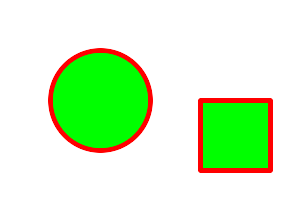

.. -*- mode: rst -*-
.. This text is in reStucturedText format, so it may look a bit odd.
.. See http://docutils.sourceforge.net/rst.html for details.

================
Magick::Drawable
================

.. contents::
   :depth: 1

Drawable provides a convenient interface for preparing vector, image,
or text arguments for the Image::draw() method. Each instance of a
Drawable sub-class represents a single drawable object. Drawable
objects may be drawn "one-by-one" via multiple invocations of the
Image `draw() <Image.html#draw>`_ method, or may be drawn
"all-at-once" by passing a list of Drawable objects to the Image
`draw() <Image.html#draw>`_ method. The one-by-one approach is
convenient for simple drawings, while the list-based approach is
appropriate for drawings which require more sophistication.

The following is an example using the Drawable subclasses with a
one-by-one approach to draw the following figure:



::

  #include <string>
  #include <iostream>
  #include <Magick++.h>

  using namespace std;
  using namespace Magick;

  int main(int /*argc*/,char **argv)
  {
    try {
      InitializeMagick(*argv);

      // Create base image (white image of 300 by 200 pixels)
      Image image( Geometry(300,200), Color("white") );

      // Set draw options
      image.strokeColor("red"); // Outline color
      image.fillColor("green"); // Fill color
      image.strokeWidth(5);

      // Draw a circle
      image.draw( DrawableCircle(100,100, 50,100) );

      // Draw a rectangle
      image.draw( DrawableRectangle(200,200, 270,170) );

      // Display the result
      image.display( );
    }
    catch( exception &error_ )
      {
        cout << "Caught exception: " << error_.what() << endl;
        return 1;
      }

    return 0;
  }

Since Drawable is an object it may be saved in an array or a list for
later (perhaps repeated) use. The following example shows how to draw
the same figure using the list-based approach::

  #include <string>
  #include <iostream>
  #include <list>
  #include <Magick++.h>

  using namespace std;
  using namespace Magick;

  int main(int /*argc*/,char **/*argv*/)
  {
    try {

      InitializeMagick(*argv);

      // Create base image (white image of 300 by 200 pixels)
      Image image( Geometry(300,200), Color("white") );

      // Construct drawing list
      std::list<Magick::Drawable> drawList;

      // Add some drawing options to drawing list
      drawList.push_back(DrawableStrokeColor("red")); // Outline color
      drawList.push_back(DrawableStrokeWidth(5)); // Stroke width
      drawList.push_back(DrawableFillColor("green")); // Fill color

      // Add a Circle to drawing list
      drawList.push_back(DrawableCircle(100,100, 50,100));

      // Add a Rectangle to drawing list
      drawList.push_back(DrawableRectangle(200,100, 270,170));

      // Draw everything using completed drawing list
      image.draw(drawList);

      // Display the result
      image.display( );
    }
    catch( exception &error_ )
      {
        cout << "Caught exception: " << error_.what() << endl;
        return 1;
      }

    return 0;
  }


Coordinate structure
--------------------

Drawable depends on the simple Coordinate structure which represents a
pair of x,y coodinates. The Coordinate structure is defined as
follows::

  class Coordinate
  {
  public:

    // Default Constructor
    Coordinate ( void );

    // Constructor, setting first & second
    Coordinate ( double x_, double y_ );

    // Destructor
    virtual ~Coordinate ();

    // x coordinate member
    void   x ( double x_ );
    double x ( void ) const;

    // y coordinate member
    void   y ( double y_ );
    double y ( void ) const;
  };

Drawable classes
----------------

Drawable classes represent objects to be drawn on the image.

.. contents:: Drawable classes
   :local:
   :depth: 1

DrawableAffine
++++++++++++++

Specify a transformation matrix to adjust scaling, rotation, and
translation (coordinate transformation) for subsequently drawn objects
in the same or decendent drawing context.  The `sx_` & `sy_` parameters
represent the x & y scale factors, the `rx_` & `ry_` parameters represent
the x & y rotation, and the `tx_` & `ty_` parameters represent the x & y
translation::

  DrawableAffine ( double sx_, double sy_,
                   double rx_, double ry_,
                   double tx_, double ty_ );

Specify a transformation matrix to adjust scaling, rotation, and
translation (coordinate transformation) for subsequently drawn objects
in the same or decendent drawing context. Initialized to unity (no
effect) affine values. Use class methods (not currently documented but
defined in the Drawable.h header file) to adjust individual parameters
from their unity values::

  DrawableAffine ( void );


DrawableArc
+++++++++++

Draw an arc using the stroke color and based on the circle starting at
coordinates `startX_`,`startY_`, and ending with coordinates
`endX_`,`endY_`, and bounded by the rotational arc
`startDegrees_`,`endDegrees_`::

  DrawableArc ( double startX_, double startY_,
                double endX_, double endY_,
                double startDegrees_, double endDegrees_ );

DrawableBezier
++++++++++++++

Draw a bezier curve using the stroke color and based on the
coordinates specified by the `coordinates_` list::

  DrawableBezier ( const CoordinateList &coordinates_ );

DrawableClipPath
++++++++++++++++

Select a drawing clip path matching `id_`::

  DrawableClipPath ( const std::string &id_ );

DrawableCircle
++++++++++++++

Draw a circle using the stroke color and thickness using specified
origin and perimeter coordinates. If a fill color is specified, then
the object is filled::

  DrawableCircle ( double originX_, double originY_,
                   double perimX_, double perimY_ )


DrawableColor
+++++++++++++

Color image according to paintMethod. The point method recolors the
target pixel.  The replace method recolors any pixel that matches the
color of the target pixel.  Floodfill recolors any pixel that matches
the color of the target pixel and is a neighbor, whereas filltoborder
recolors any neighbor pixel that is not the border color. Finally,
reset recolors all pixels::

  DrawableColor ( double x_, double y_,
                  PaintMethod paintMethod_ )


DrawableCompositeImage
++++++++++++++++++++++

Composite current image with contents of specified image, at specified
coordinates. If the matte attribute is set to true, then the image
composition will consider an alpha channel, or transparency, present
in the image file so that non-opaque portions allow part (or all) of
the composite image to show through::

  DrawableCompositeImage ( double x_, double y_,
                           const std::string &filename_ );
  DrawableCompositeImage ( double x_, double y_,
                           const Image &image_ );

Composite current image with contents of specified image, rendered
with specified width and height, at specified coordinates. If the
matte attribute is set to true, then the image composition will
consider an alpha channel, or transparency, present in the image file
so that non-opaque portions allow part (or all) of the composite image
to show through. If the specified width or height is zero, then the
image is composited at its natural size, without enlargement or
reduction::

  DrawableCompositeImage ( double x_, double y_,
                           double width_, double height_,
                           const std::string &filename_ );

  DrawableCompositeImage ( double x_, double y_,
                           double width_, double height_,
                           const Image &image_ );

Composite current image with contents of specified image, rendered
with specified width and height, using specified composition
algorithm, at specified coordinates. If the matte attribute is set to
true, then the image composition will consider an alpha channel, or
transparency, present in the image file so that non-opaque portions
allow part (or all) of the composite image to show through. If the
specified width or height is zero, then the image is composited at its
natural size, without enlargement or reduction::

  DrawableCompositeImage ( double x_, double y_,
                           double width_, double height_,
                           const std::string &filename_,
                           CompositeOperator composition_ );

  DrawableCompositeImage ( double x_, double y_,
                           double width_, double height_,
                           const Image &image_,
                           CompositeOperator composition_ );


DrawableDashArray
+++++++++++++++++

Specify the pattern of dashes and gaps used to stroke paths. The
strokeDashArray represents a zero-terminated array of numbers that
specify the lengths of alternating dashes and gaps in pixels. If an
odd number of values is provided, then the list of values is repeated
to yield an even number of values.  A typical `strokeDashArray_` array
might contain the members 5 3 2 0, where the zero value indicates the
end of the pattern array::

  DrawableDashArray( const double* dasharray_ );

DrawableDashOffset
++++++++++++++++++

Specify the distance into the dash pattern to start the dash. See
documentation on SVG's `stroke-dashoffset
<http://www.w3.org/TR/SVG/painting.html#StrokeDashoffsetProperty>`_
property for usage details::

  DrawableDashOffset ( const double offset_ )

DrawableEllipse
+++++++++++++++

Draw an ellipse using the stroke color and thickness, specified
origin, x & y radius, as well as specified start and end of arc in
degrees. If a fill color is specified, then the object is filled::

  DrawableEllipse ( double originX_, double originY_, 
                    double radiusX_, double radiusY_,
                    double arcStart_, double arcEnd_ )

DrawableFillColor
+++++++++++++++++

Specify drawing object fill color:

  DrawableFillColor ( const Color &color_ );

DrawableFillRule
++++++++++++++++

Specify the algorithm which is to be used to determine what parts of
the canvas are included inside the shape. See documentation on SVG's
`fill-rule <http://www.w3.org/TR/SVG/painting.html#FillRuleProperty>`_
property for usage details::

  DrawableFillRule ( const FillRule fillRule_ )

DrawableFillOpacity
+++++++++++++++++++

Specify opacity to use when drawing using fill color::

  DrawableFillOpacity ( double opacity_ )

DrawableFont
++++++++++++

Specify font family, style, weight (one of the set { 100 | 200 | 300 |
400 | 500 | 600 | 700 | 800 | 900 } with 400 being the normal size),
and stretch to be used to select the font used when drawing
text. Wildcard matches may be applied to style via the AnyStyle
enumeration, applied to weight if weight is zero, and applied to
stretch via the AnyStretch enumeration::

  DrawableFont ( const std::string &font_ );

  DrawableFont ( const std::string &family_,
                 StyleType style_,
                 const unsigned long weight_,
                 StretchType stretch_ );

DrawableGravity
+++++++++++++++

Specify text positioning gravity::

  DrawableGravity ( GravityType gravity_ )

DrawableLine
++++++++++++

Draw a line using stroke color and thickness using starting and ending
coordinates::

  DrawableLine ( double startX_, double startY_,
                 double endX_, double endY_ )

DrawableMatte
+++++++++++++

Change the pixel matte value to transparent. The point method changes
the matte value of the target pixel.  The replace method changes the
matte value of any pixel that matches the color of the target
pixel. Floodfill changes the matte value of any pixel that matches the
color of the target pixel and is a neighbor, whereas filltoborder
changes the matte value of any neighbor pixel that is not the border
color, Finally reset changes the matte value of all pixels::

  DrawableMatte ( double x_, double y_,
                  PaintMethod paintMethod_ )

DrawableMiterLimit
++++++++++++++++++

Specify miter limit. When two line segments meet at a sharp angle and
miter joins have been specified for 'lineJoin', it is possible for the
miter to extend far beyond the thickness of the line stroking the
path. The miterLimit' imposes a limit on the ratio of the miter length
to the 'lineWidth'. The default value of this parameter is 4::

  DrawableMiterLimit ( unsigned int miterlimit_ )

DrawablePath
++++++++++++

Draw on image using vector path::

  DrawablePath ( const VPathList &path_ );

DrawablePoint
+++++++++++++

Draw a point using stroke color and thickness at coordinate::

  DrawablePoint ( double x_, double y_ )

DrawablePointSize
+++++++++++++++++

Set font point size::

  DrawablePointSize ( double pointSize_ )

DrawablePolygon
+++++++++++++++

Draw an arbitrary polygon using stroke color and thickness consisting
of three or more coordinates contained in an STL list. If a fill color
is specified, then the object is filled::

  DrawablePolygon ( const CoordinateList &coordinates_ )

DrawablePolyline
++++++++++++++++

Draw an arbitrary polyline using stroke color and thickness consisting
of three or more coordinates contained in an STL list. If a fill color
is specified, then the object is filled::

  DrawablePolyline ( const CoordinateList &coordinates_ )

DrawablePopClipPath
+++++++++++++++++++

Pop (terminate) clip path definition started by DrawablePushClipPath::

  DrawablePopClipPath ( void )

DrawablePopGraphicContext
+++++++++++++++++++++++++

Pop Graphic Context. Removing the current graphic context from the
graphic context stack restores the options to the values they had
prior to the preceding DrawablePushGraphicContext_ operation::

  DrawablePopGraphicContext ( void )

DrawablePushClipPath
++++++++++++++++++++

Push (create) clip path definition with `id_`. Clip patch definition
consists of subsequent drawing commands, terminated by
DrawablePopClipPath_::

  DrawablePushClipPath ( const std::string &id_)

DrawablePushGraphicContext
++++++++++++++++++++++++++

Push Graphic Context. When a graphic context is pushed, options set
after the context is pushed (such as coordinate transformations, color
settings, etc.) are saved to a new graphic context. This allows
related options to be saved on a graphic context "stack" in order to
support heirarchical nesting of options. When
DrawablePopGraphicContext_ is used to pop the current graphic context,
the options in effect during the last DrawablePushGraphicContext_
operation are restored::

  DrawablePushGraphicContext ( void )

DrawablePushPattern
+++++++++++++++++++

Start a pattern definition with arbitrary pattern name specified by
`id_`, pattern offset specified by `x_` and `y_`, and pattern size
specified by `width_` and `height_`. The pattern is defined within the
coordinate system defined by the specified offset and size. Arbitrary
drawing objects (including DrawableCompositeImage_) may be specified
between DrawablePushPattern_ and DrawablePopPattern_ in order to draw
the pattern. Normally the pair DrawablePushGraphicContext_ &
DrawablePopGraphicContext_ are used to enclose a pattern
definition. Pattern definitions are terminated by a
DrawablePopPattern_ object::

  DrawablePushPattern ( const std::string &id_, long x_, long y_,
                        long width_, long height_ )


DrawablePopPattern
++++++++++++++++++

Terminate a pattern definition started via DrawablePushPattern_::

  DrawablePopPattern ( void )

DrawableRectangle
+++++++++++++++++

Draw a rectangle using stroke color and thickness from upper-left
coordinates to lower-right coordinates. If a fill color is specified,
then the object is filled::

  DrawableRectangle ( double upperLeftX_, double upperLeftY_,
                      double lowerRightX_, double lowerRightY_ )

DrawableRotation
++++++++++++++++

Set rotation to use when drawing (coordinate transformation)::

  DrawableRotation ( double angle_ )

DrawableRoundRectangle
++++++++++++++++++++++

Draw a rounded rectangle using stroke color and thickness, with
specified center coordinate, specified width and height, and specified
corner width and height.  If a fill color is specified, then the
object is filled::

  DrawableRoundRectangle ( double centerX_, double centerY_,
                           double width_, double hight_,
                           double cornerWidth_, double cornerHeight_ )

DrawableScaling
+++++++++++++++

Apply scaling in x and y direction while drawing objects (coordinate
transformation)::

  DrawableScaling ( double x_, double y_ )

DrawableSkewX
+++++++++++++

Apply Skew in X direction (coordinate transformation)::

  DrawableSkewX ( double angle_ )

DrawableSkewY
+++++++++++++

Apply Skew in Y direction::

  DrawableSkewY ( double angle_ )

DrawableStrokeAntialias
+++++++++++++++++++++++

Antialias while drawing lines or object outlines::

  DrawableStrokeAntialias ( bool flag_ )

DrawableStrokeColor
+++++++++++++++++++

Set color to use when drawing lines or object outlines::

  DrawableStrokeColor ( const Color &color_ )

DrawableStrokeLineCap
+++++++++++++++++++++

Specify the shape to be used at the end of open subpaths when they are
stroked. Values of LineCap are UndefinedCap, ButtCap, RoundCap, and
SquareCap::

  DrawableStrokeLineCap ( LineCap linecap_ )

DrawableStrokeLineJoin
++++++++++++++++++++++

Specify the shape to be used at the corners of paths (or other vector
shapes) when they are stroked. Values of LineJoin are UndefinedJoin,
MiterJoin, RoundJoin, and BevelJoin::

  DrawableStrokeLineJoin ( LineJoin linejoin_ )

DrawableStrokeOpacity
+++++++++++++++++++++

Opacity to use when drawing lines or object outlines::

  DrawableStrokeOpacity ( double opacity_ )

DrawableStrokeWidth
+++++++++++++++++++

Set width to use when drawing lines or object outlines::

  DrawableStrokeWidth ( double width_ )

DrawableText
++++++++++++

Annotate image with text using stroke color, font, font pointsize, and
box color (text background color), at specified coordinates. If text
contains `special format characters <FormatCharacters.html>`_ the
image filename, type, width, height, or other image attributes may be
incorporated in the text (see label())::

  DrawableText ( const double x_, const double y_,
                 const std::string &text_ )

Annotate image with text represented with text encoding, using current
stroke color, font, font pointsize, and box color (text background
color), at specified coordinates. If text contains `special format
characters <FormatCharacters.html>`_ the image filename, type, width,
height, or other image attributes may be incorporated in the text (see
label()).

The text encoding specifies the code set to use for text
annotations. The only character encoding which may be specified at
this time is "UTF-8" for representing `Unicode
<http://www.unicode.org/>`_ as a sequence of bytes. Specify an empty
string to set text encoding to the system's default. Successful text
annotation using Unicode may require fonts designed to support
Unicode::

  DrawableText ( const double x_, const double y_,
                 const std::string &text_, const std::string &encoding_)

DrawableTextAntialias
+++++++++++++++++++++

Antialias while drawing text (default true). The main reason to
disable text antialiasing is to avoid adding new colors to the image::

  DrawableTextAntialias ( bool flag_ )

DrawableTextDecoration
++++++++++++++++++++++

Specify decoration (e.g. UnderlineDecoration) to apply to text::

  DrawableTextDecoration ( DecorationType decoration_ )

DrawableTextUnderColor
++++++++++++++++++++++

Draw a box under rendered text using the specified color::

  DrawableTextUnderColor ( const Color &color_ )

DrawableTranslation
+++++++++++++++++++

Apply coordinate translation (set new coordinate origin)::

  DrawableTranslation ( double x_, double y_ )

DrawableViewbox
+++++++++++++++

Dimensions of the output viewbox. If the image is to be written to a
vector format (e.g. MVG or SVG), then a DrawablePushGraphicContext_
object should be pushed to the head of the list, followed by a
DrawableViewbox_ object to establish the output canvas size. A
matching DrawablePopGraphicContext_ object should be pushed to the
tail of the list::

  DrawableViewbox(unsigned long x1_, unsigned long y1_,
                  unsigned long x2_, unsigned long y2_)

Vector Path Classes
-------------------

The vector paths supported by Magick++ are based on those supported by
the `SVG XML specification
<http://www.w3.org/TR/SVG/paths.html>`_. Vector paths are not directly
drawable, they must first be supplied as a constructor argument to the
DrawablePath_ class in order to create a drawable object. The
DrawablePath_ class effectively creates a drawable compound component
which may be replayed as desired. If the drawable compound component
consists only of vector path objects using relative coordinates then
the object may be positioned on the image by preceding it with a
DrawablePath_ which sets the current drawing coordinate. Alternatively
coordinate transforms may be used to `translate the origin
<#DrawableTranslation>`_ in order to position the object, rotate it,
skew it, or scale it.

.. contents:: Vector path commands
   :local:
   :depth: 1

The "moveto" commands
+++++++++++++++++++++

The "moveto" commands establish a new current point. The effect is as
if the "pen" were lifted and moved to a new location. A path data
segment must begin with either one of the "moveto" commands or one of
the "arc" commands. Subsequent "moveto" commands (i.e., when the
"moveto" is not the first command) represent the start of a new
subpath.

Start a new sub-path at the given coordinate. PathMovetoAbs indicates
that absolute coordinates will follow; PathMovetoRel indicates that
relative coordinates will follow. If a relative moveto appears as the
first element of the path, then it is treated as a pair of absolute
coordinates. If a moveto is followed by multiple pairs of coordinates,
the subsequent pairs are treated as implicit lineto commands.

PathMovetoAbs
~~~~~~~~~~~~~

Simple moveto::

  PathMovetoAbs ( const Magick::Coordinate &coordinate_ )

Moveto followed by implicit linetos::

  PathMovetoAbs ( const CoordinateList &coordinates_ )

PathMovetoRel
~~~~~~~~~~~~~

Simple moveto::

  PathMovetoRel ( const Magick::Coordinate &coordinate_ );

Moveto followed by implicit linetos::

  PathMovetoRel ( const CoordinateList &coordinates_ );

The "closepath" command
+++++++++++++++++++++++

The "closepath" command causes an automatic straight line to be drawn from the current point to the initial point of the current subpath.

PathClosePath
~~~~~~~~~~~~~

Close the current subpath by drawing a straight line from the current
point to current subpath's most recent starting point (usually, the
most recent moveto point)::

  PathClosePath ( void )

The "lineto" commands
+++++++++++++++++++++

The various "lineto" commands draw straight lines from the current
point to a new point.

PathLinetoAbs
~~~~~~~~~~~~~

Draw a line from the current point to the given coordinate which
becomes the new current point.  *PathLinetoAbs* indicates that absolute
coordinates are used. A number of coordinates pairs may be specified
in a list to draw a polyline. At the end of the command, the new
current point is set to the final set of coordinates provided.

Draw to a single point::

  PathLinetoAbs ( const Magick::Coordinate& coordinate_  );

Draw to multiple points::

  PathLinetoAbs ( const CoordinateList &coordinates_ );

PathLinetoRel
~~~~~~~~~~~~~

Draw a line from the current point to the given coordinate which
becomes the new current point. *PathLinetoRel* indicates that relative
coordinates are used. A number of coordinates pairs may be specified
in a list to draw a polyline. At the end of the command, the new
current point is set to the final set of coordinates provided.

Draw to a single point::

  PathLinetoRel ( const Magick::Coordinate& coordinate_ );

Draw to multiple points::

  PathLinetoRel ( const CoordinateList &coordinates_ );

PathLinetoHorizontalAbs
~~~~~~~~~~~~~~~~~~~~~~~~

Draws a horizontal line from the current point (cpx, cpy) to (x,
cpy). *PathLinetoHorizontalAbs* indicates that absolute coordinates
are supplied.  At the end of the command, the new current point
becomes (x, cpy) for the final value of x::

  PathLinetoHorizontalAbs ( double x_ )

PathLinetoHorizontalRel
~~~~~~~~~~~~~~~~~~~~~~~

Draws a horizontal line from the current point (cpx, cpy) to (x,
cpy). *PathLinetoHorizontalRel* indicates that relative coordinates
are supplied. At the end of the command, the new current point becomes
(x, cpy) for the final value of x::

  PathLinetoHorizontalRel ( double x_ )

PathLinetoVerticalAbs
~~~~~~~~~~~~~~~~~~~~~

Draws a vertical line from the current point (cpx, cpy) to (cpx,
y). *PathLinetoVerticalAbs* indicates that absolute coordinates are
supplied.  At the end of the command, the new current point becomes
(cpx, y) for the final value of y::

  PathLinetoVerticalAbs ( double y_ )

PathLinetoVerticalRel
~~~~~~~~~~~~~~~~~~~~~

Draws a vertical line from the current point (cpx, cpy) to (cpx, y).
*PathLinetoVerticalRel* indicates that relative coordinates are
supplied.  At the end of the command, the new current point becomes
(cpx, y) for the final value of y::

  PathLinetoVerticalRel ( double y_ )

Curve commands
++++++++++++++

These three groups of commands draw curves:

* Cubic Bézier commands.

  A cubic Bézier segment is defined by a start point, an end point,
  and two control points.

* Quadratic Bézier commands.

  A quadratic Bézier segment is defined by a start point, an end
  point, and one control point.

* Elliptical arc commands.

  An elliptical arc segment draws a segment of an ellipse.

.. contents:: Curve Commands
   :local:
   :depth: 1


Cubic Bézier curve commands
~~~~~~~~~~~~~~~~~~~~~~~~~~~

.. contents:: Cubic Bézier curve commands
   :local:
   :depth: 1

PathCurvetoArgs
```````````````

The cubic Bézier commands depend on the PathCurvetoArgs_ argument
class, which has the constructor signature::

  PathCurvetoArgs( double x1_, double y1_,
                   double x2_, double y2_,
                   double x_, double y_ );

PathCurveto:

Draws a cubic Bézier curve from the current point to (*x*,*y*) using
(*x1*,*y1*) as the control point at the beginning of the curve and
(*x2*,*y2*) as the control point at the end of the
curve. PathCurvetoAbs_ indicates that absolutecoordinates will follow;
PathCurvetoRel_ indicates that relative coordinates will
follow. Multiple sets of coordinates may be specified to draw a
polybezier. At the end of the command, the new current point becomes
the final (*x*,*y*) coordinate pair used in the polybezier.

PathCurvetoAbs
``````````````

Draw a single curve::

  PathCurvetoAbs ( const PathCurvetoArgs &args_ );

Draw multiple curves::

  PathCurvetoAbs ( const PathCurveToArgsList &args_ );

PathCurvetoRel
``````````````

Draw a single curve::

  PathCurvetoRel ( const PathCurvetoArgs &args_ );

Draw multiple curves::

  PathCurvetoRel ( const PathCurveToArgsList &args_ );

PathSmoothCurveto:

Draws a cubic Bézier curve from the current point to (x,y). The first
control point is assumed to be the reflection of the second control
point on the previous command relative to the current point. (If there
is no previous command or if the previous command was not an
PathCurvetoAbs, PathCurvetoRel, PathSmoothCurvetoAbs or
PathSmoothCurvetoRel, assume the first control point is coincident
with the current point.) (x2,y2) is the second control point (i.e.,
the control point at the end of the curve).  PathSmoothCurvetoAbs
indicates that absolute coordinates will follow; PathSmoothCurvetoRel
indicates that relative coordinates will follow. Multiple sets of
coordinates may be specified to draw a polybezier. At the end of the
command, the new current point becomes the final (x,y) coordinate pair
used in the polybezier.

PathSmoothCurvetoAbs
````````````````````

Draw a single curve::

  PathSmoothCurvetoAbs ( const Magick::Coordinate &coordinates_ );

Draw multiple curves

  PathSmoothCurvetoAbs ( const CoordinateList &coordinates_ );

PathSmoothCurvetoRel
````````````````````

Draw a single curve::

  PathSmoothCurvetoRel ( const Coordinate &coordinates_ );

Draw multiple curves::

  PathSmoothCurvetoRel ( const CoordinateList &coordinates_ );

Quadratic Bézier curve commands
~~~~~~~~~~~~~~~~~~~~~~~~~~~~~~~~~~~

.. contents:: Quadratic Bézier curve commands
   :local:
   :depth: 1

PathQuadraticCurvetoArgs
````````````````````````

The quadratic Bézier commands depend on the PathQuadraticCurvetoArgs_
argument class, which has the constructor signature::

  PathQuadraticCurvetoArgs( double x1_, double y1_,
                            double x_, double y_ );


PathQuadraticCurvetoAbs
```````````````````````

Draw a single curve::

  PathQuadraticCurvetoAbs ( const Magick::PathQuadraticCurvetoArgs &args_ );

Draw multiple curves::

  PathQuadraticCurvetoAbs ( const PathQuadraticCurvetoArgsList &args_ );

PathQuadraticCurvetoRel
```````````````````````

Draw a single curve::

  PathQuadraticCurvetoRel ( const Magick::PathQuadraticCurvetoArgs &args_ );

Draw multiple curves::

  PathQuadraticCurvetoRel ( const PathQuadraticCurvetoArgsList &args_ );

PathSmoothQuadraticCurvetoAbs
`````````````````````````````

Draw a single curve::

  PathSmoothQuadraticCurvetoAbs ( const Magick::Coordinate &coordinate_ );

Draw multiple curves::

  PathSmoothQuadraticCurvetoAbs ( const CoordinateList &coordinates_ );

PathSmoothQuadraticCurvetoRel
`````````````````````````````

Draw a single curve::

  PathSmoothQuadraticCurvetoRel ( const Magick::Coordinate &coordinate_ );


Draw multiple curves::

  PathSmoothQuadraticCurvetoRel ( const CoordinateList &coordinates_ );

Elliptical arc curve commands
~~~~~~~~~~~~~~~~~~~~~~~~~~~~~~~~~

.. contents:: Elliptical arc curve commands
   :local:
   :depth: 1

PathArcArgs
```````````

The elliptical arc curve commands depend on the PathArcArgs argument
class, which has the constructor signature::

  PathArcArgs( double radiusX_, double radiusY_,
               double xAxisRotation_, bool largeArcFlag_,
               bool sweepFlag_, double x_, double y_ );

Draws an elliptical arc from the current point to (*x*, *y*). The size and
orientation of the ellipse are defined by two radii (*radiusX*, *radiusY*)
and an *xAxisRotation*, which indicates how the ellipse as a whole is
rotated relative to the current coordinate system. The center (cx, cy)
of the ellipse is calculated automatically to satisfy the constraints
imposed by the other parameters. *largeArcFlag* and *sweepFlag* contribute
to the automatic calculations and help determine how the arc is
drawn. If *largeArcFlag* is true then draw the larger of the available
arcs. If *sweepFlag* is true, then draw the arc matching a clock-wise
rotation.

PathArcAbs
``````````

Draw a single arc segment::

  PathArcAbs ( const PathArcArgs &coordinates_ );

Draw multiple arc segments::

  PathArcAbs ( const PathArcArgsList &coordinates_ );

PathArcRel
``````````

Draw a single arc segment::

  PathArcRel ( const PathArcArgs &coordinates_ );

Draw multiple arc segments::

  PathArcRel ( const PathArcArgsList &coordinates_ );

.. |copy|   unicode:: U+000A9 .. COPYRIGHT SIGN

Copyright |copy| Bob Friesenhahn 1999 - 2015

