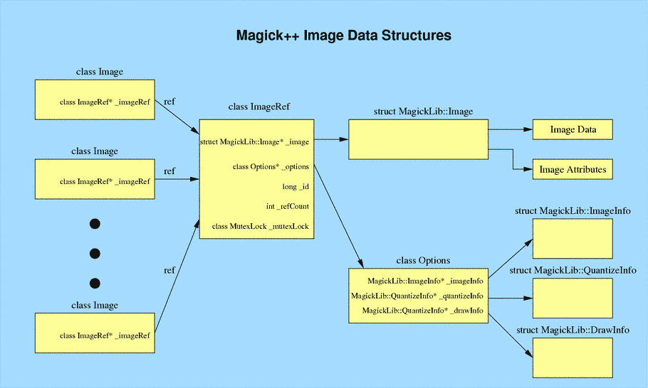

.. -*- mode: rst -*-
.. This text is in reStucturedText format, so it may look a bit odd.
.. See http://docutils.sourceforge.net/rst.html for details.

=============================
Magick::Image Data Structures
=============================

The class Magick::Image is a simple handle which points to a
reference-counted image representation. This allows multiple
Magick::Image instances to share the same image and attributes. At the
point in time that the image data, or image attributes are modified
and the current reference count is greater than one, the image data
and attributes are copied to create a new image with a reference count
of one and the reference count on the old image is decremented. If the
reference count on the old image becomes zero, then the associated
reference and data are deleted. This strategy represents a simple (but
effective) form of garbage collection.

.. |copy|   unicode:: U+000A9 .. COPYRIGHT SIGN

Copyright |copy| Bob Friesenhahn 1999 - 2015

