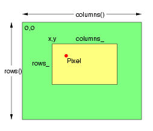

.. -*- mode: rst -*-
.. This text is in reStucturedText format, so it may look a bit odd.
.. See http://docutils.sourceforge.net/rst.html for details.

==============
Magick::Pixels
==============

The Pixels class provides efficient access to raw image pixels. Image
pixels (of type `PixelPacket <PixelPacket.html>`_) may be accessed
directly via the Image Pixel Cache. The image pixel cache is a
rectangular window (a view) into the actual image pixels (which may be
in memory, memory-mapped from a disk file, or entirely on
disk). Obtain existing image pixels via get(). Create a new pixel
region using set().

Depending on the capabilities of the operating system, and the
relationship of the window to the image, the pixel cache may be a copy
of the pixels in the selected window, or it may be the actual image
pixels. In any case calling sync() insures that the base image is
updated with the contents of the modified pixel cache. The method
decode()supports copying foreign pixel data formats into the pixel
cache according to the QuantumTypes. The method encode() supports
copying the pixels in the cache to a foreign pixel representation
according to the format specified by QuantumTypes.

Setting a view using the Pixels class does not cause the number of
references to the underlying image to be reduced to one. Therefore, in
order to ensure that only the current generation of the image is
modified, the Image's modifyImage() method should be invoked to reduce
the reference count on the underlying image to one. If this is not
done, then it is possible for a previous generation of the image to be
modified due to the use of reference counting when copying or
constructing an Image.

The PixelPacket* returned by the set and get methods, and the
IndexPacket* returned by the indexes method point to pixel data
managed by the Pixels class. The Pixels class is responsible for
releasing resources associated with the pixel view. This means that
the pointer should never be passed to delete() or free().

.. Probably want bottom alignment for above (but not accepted by
.. currently installed rst2html.py parser)

The pixel view is a small image in which the pixels may be accessed,
addressed, and updated, as shown in the following example, which
produces an image similar to the one on the right (minus lines and
text)::

  // Create base image
  Image image(Geometry(254,218), "white");

  // Set the image type to TrueColor DirectClass representation.
  image.type(TrueColorType);

  // Ensure that there is only one reference to underlying image
  // If this is not done, then image pixels will not be modified.
  image.modifyImage();

  // Allocate pixel view
  Pixels view(image);

  // Set all pixels in region anchored at 38x36, with size 160x230 to green.
  unsigned int columns = 196; unsigned int rows = 162;
  Color green("green");
  PixelPacket *pixels = view.get(38,36,columns,rows);
  for ( int row = 0; row < rows ; ++row )
  for ( int column = 0; column < columns ; ++column )
  *pixels++=green;

  // Save changes to image.
  view.sync();

  // Set all pixels in region anchored at 86x72, with size 108x67 to yellow.
  columns = 108; rows = 67;
  Color yellow("yellow");
  pixels = view.get(86,72,columns,rows);
  for ( int row = 0; row < rows ; ++row )
  for ( int column = 0; column < columns ; ++column )
  *pixels++=yellow;
  view.sync();

  // Set pixel at position 108,94 to red
  *(view.get(108,94,1,1)) = Color("red");  

  // Save changes to image.
  view.sync();

The following is the definition of the Magick::Pixels class::

  class Pixels
  {
  public:

    // Construct pixel view using specified image.
    Pixels( Magick::Image &image_ );

    // Destroy pixel view
    ~Pixels( void );
    
    // Transfer pixels from the image to the pixel view as defined by
    // the specified region. Modified pixels may be subsequently
    // transferred back to the image via sync.
    PixelPacket* get ( const int x_, const int y_,
		       const unsigned int columns_,const  unsigned int rows_ );

    // Transfer read-only pixels from the image to the pixel view as
    // defined by the specified region.
    const PixelPacket* getConst ( const int x_, const int y_,
                                  const unsigned int columns_,
                                  const unsigned int rows_ );
    
    // Transfers the image view pixels to the image.
    void sync ( void );
    
    // Allocate a pixel view region to store image pixels as defined
    // by the region rectangle.  This area is subsequently transferred
    // from the pixel view to the image via sync.
    PixelPacket* set ( const int x_, const int y_,
		       const unsigned int columns_, const unsigned int rows_ );

    // Return pixel colormap index array
    IndexPacket* indexes ( void );

    // Left ordinate of view
    int x ( void ) const;

    // Top ordinate of view
    int y ( void ) const;

    // Width of view
    unsigned int columns ( void ) const;

    // Height of view
    unsigned int rows ( void ) const;

  };

.. |copy|   unicode:: U+000A9 .. COPYRIGHT SIGN

Copyright |copy| Bob Friesenhahn 1999 - 2015

